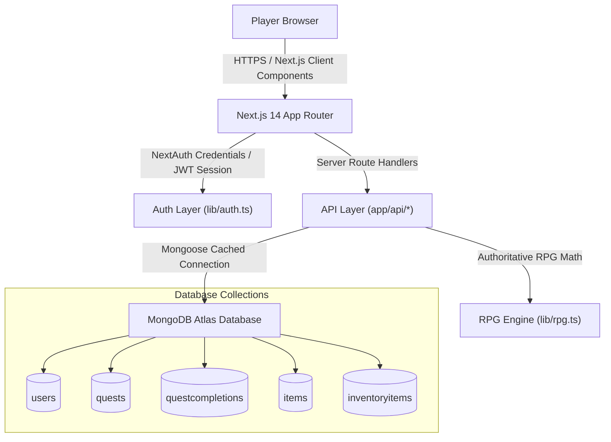
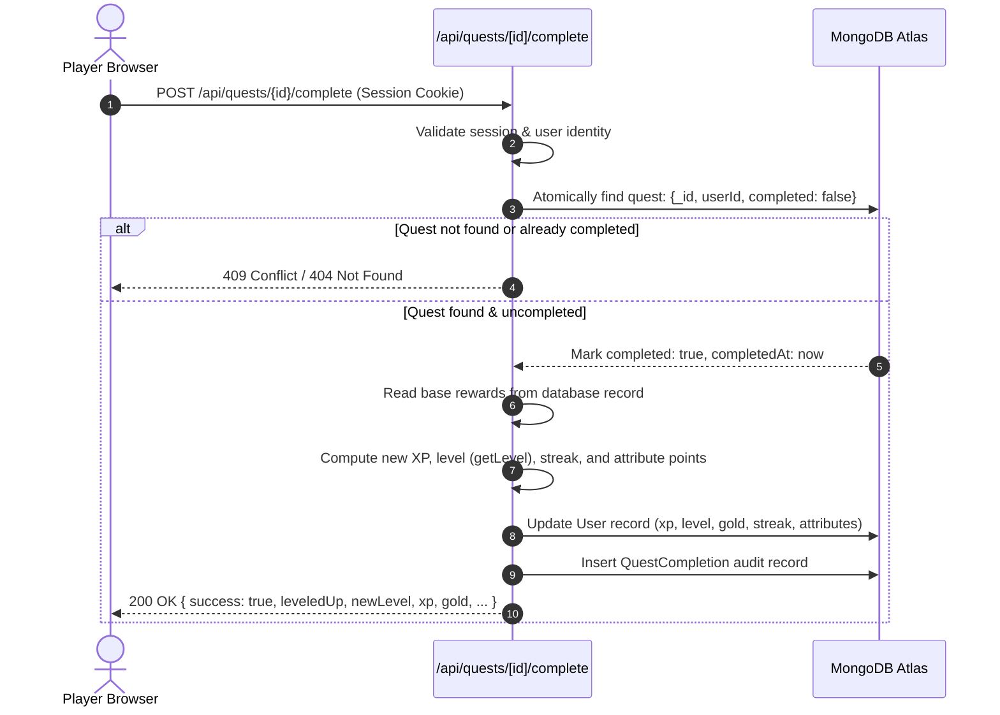

# ASCEND — Life RPG

> Turn real-world habits and productivity into an arcane progression RPG.

[](https://ascendliferpg.mohdasifv1.dev)
[](https://github.com/mohdasif-v1/ascend-life-rpg)
[](https://github.com/mohdasif-v1/ascend-life-rpg)

- **Live Application:** [https://ascendliferpg.mohdasifv1.dev](https://ascendliferpg.mohdasifv1.dev)
- **Source Repository:** [https://github.com/mohdasif-v1/ascend-life-rpg](https://github.com/mohdasif-v1/ascend-life-rpg)
- **Demo Video Status:**
  > **Demo video: outstanding — needs to be re-exported as `.mp4` and uploaded to a public host (unlisted YouTube, or committed directly to the repo) before submission.**

---

## What is ASCEND

ASCEND transforms daily tasks and self-discipline into a dark-fantasy RPG progression system:

1. **Real-World Quests:** Players forge quests categorized under real-life domains (Coding, Study, Fitness, Health, Mindfulness, Discipline).
2. **Authoritative Progression:** Completing quests awards Experience Points (XP) and Gold. XP increases character level using an exponential threshold curve.
3. **Core Attributes:** Each quest advances one of five core character attributes: **Strength**, **Intellect**, **Vitality**, **Focus**, or **Discipline**.
4. **Daily Streaks:** Daily task completion tracks active calendar-day streaks and records personal longest streaks.
5. **Armory & Virtual Economy:** Gold earned through real tasks can be redeemed in the Armory for relics, equipment, and tomes that confer attribute bonuses.
6. **Chronicle Ledger:** An immutable audit log records all completed quests with timestamps, XP, Gold, and attribute distributions.

---

## Features

- **Authentication:** NextAuth Credentials provider with JSON Web Tokens (JWT). Passwords hashed using bcrypt (12 salt rounds).
- **Quest System:** Full CRUD for player quests with categorical filtering, difficulty grading, and attribute assignments.
- **Authoritative Server-Side RPG Engine:**
  - Strict non-linear level curve:
    ```javascript
    xpForLevel(level) = Math.floor(100 * Math.pow(level, 1.5))
    ```
  - Level-Up thresholds:
    - Level 1: `0 XP`
    - Level 2: `282 XP`
    - Level 3: `519 XP`
    - Level 4: `800 XP`
    - Level 5: `1,118 XP`
- **Level-Up Celebration:** High-impact arcane celebration modal featuring level milestones, sound feedback support, and reduced-motion fallback options.
- **Armory Economy:** Virtual shop with unique items. Purchases enforce atomic balance verification (`$gte: price`) and atomic gold deduction (`$inc: -price`).
- **Chronicle History:** Reverse-chronological ledger tracking past quest accomplishments with populated metadata.
- **AI Oracle Quest Generator:** Converts real-world tasks and ambitions into tailored RPG trials using Google Gemini (`gemini-3.6-flash`). Features server-side Zod validation, retry fallback, and a daily rate limit of 5 requests/day. Drafts are human-reviewed and editable before creation.
- **Redemption Quests (Sacred Ember Streak Forgiveness):** Directly answers the classic behavioral pitfall where one missed day resets a streak to zero and causes abandonment. If a user misses exactly one day with a streak $\ge 2$, their status transitions to `ember` with a countdown to midnight UTC. Completing the generated narrative Redemption Quest restores their full streak counter (`preStreakValue + 1`) with an extra bonus (+25 XP, +15 Gold).
  - *Abuse Guard:* Deliberately capped to at most once per 7 days per user (`lastRedemptionAt`), ensuring forgiveness remains a rare salvation rather than consequence-free negligence.
- **Questlines (Chained Progressive Decomposition):** Turns large, overwhelming ambitions into an ordered, escalating chain of 3–5 milestone quests. Built with genuine task decomposition and RPG depth (skill-tree style sequential unlocking).
  - *Server-Enforced Locking:* Quests beyond Step 1 start locked (`locked: true`). Calling the completion endpoint on a locked step strictly returns `403 Forbidden`. Finishing a step automatically unlocks the next step in the sequence.
  - *Campaign Bonus:* Fulfilling the final trial marks the Questline `completed` and unlocks a celebratory Campaign Conquered modal awarding a grand bonus of `+200 XP` and `+100 Gold`.
- **AI Saga Mode:** Summarizes recent completed trials from the Chronicle into an in-character narrative recap recited by the Oracle Chronicler.
- **Accessibility & UX:** Strict keyboard focus rings (`focus-visible:ring-2`), semantic HTML headings, screen-reader descriptions, and zero emojis (100% SVG icon components via `lucide-react`).

---

## AI Features & Security Architecture

ASCEND integrates Google Gemini (`@google/generative-ai` with `gemini-3.6-flash`) designed around zero-trust client principles:

1. **Server-Side Key Isolation:** `GEMINI_API_KEY` is strictly server-side. No client ever receives or communicates with the LLM API directly. No new environment variables are needed as existing credentials and AI infrastructure are fully reused.
2. **Authoritative Numbers (No Stat Manipulation):** The AI suggests trial concepts and escalating step progressions, but the server authoritatively derives XP and Gold rewards using `getQuestRewards(difficulty)`. The client cannot manipulate rewards or progression state through AI prompt injection.
3. **Strict Validation & Retries:** AI responses must conform to strict JSON schemas parsed through `Zod` (`QuestDraftsArraySchema`, `QuestlineGeminiSchema`, `RedemptionQuestSchema`). If an output is malformed, the server performs an automatic single retry with strict formatting constraints; if still invalid, a graceful fallback is provided.
4. **Human Review Before Persistence:** AI quest drafts and questlines are never auto-inserted into the database. Players review, reorder, edit titles or tactical instructions, and explicitly confirm which trials to forge into their active quest log.
5. **Shared Per-User Rate Limiting:** Daily generation quota is tracked on the user document (`aiGenerationsToday`, `aiGenerationsResetAt`) and capped at 5 divinations every 24 hours across Oracle quests and Questlines to prevent abuse and protect API resources.
6. **Server-Side Locked Quest Enforcement:** Sequential questlines enforce step unlocking server-side. Direct API completion requests for locked quests are rejected with `403 Forbidden`.
7. **Redemption Abuse Guard:** Users can only invoke the Sacred Ember streak-redemption mechanic once every 7 days (`lastRedemptionAt`), preventing users from bypassing daily habit discipline.

---

## System Architecture

ASCEND is built as a single, cohesive full-stack Next.js application running on Vercel and connected to MongoDB Atlas.



---

## Quest Completion & Reward Flow

All game mechanics, XP gains, level transitions, and Gold rewards are calculated exclusively on the server. The client never submits reward numbers.



---

## Database Schemas

ASCEND models data using Mongoose schemas defined in `/models`:

| Collection | Model File | Key Fields | Indexes & Constraints |
| :--- | :--- | :--- | :--- |
| **`users`** | [`models/User.ts`](models/User.ts) | `email`, `passwordHash`, `level`, `xp`, `gold`, `currentStreak`, `longestStreak`, `lastActivityDate`, `attributes`, `streakStatus` (`'active'` \| `'ember'`), `emberDeadline`, `preStreakValue`, `lastRedemptionAt`, `aiGenerationsToday`, `aiGenerationsResetAt` | Unique index on `email`. Min bounds on stats. |
| **`quests`** | [`models/Quest.ts`](models/Quest.ts) | `title`, `description`, `category`, `attribute`, `difficulty`, `xpReward`, `goldReward`, `completed`, `completedAt`, `userId`, `source`, `isRedemption`, `expiresAt`, `questlineId`, `order`, `locked` | Compound index on `{ userId: 1, createdAt: -1 }`. Foreign key reference to `User` and `Questline`. |
| **`questlines`** | [`models/Questline.ts`](models/Questline.ts) | `userId`, `title`, `goal`, `status` (`'active'` \| `'completed'` \| `'abandoned'`), `createdAt` | Index on `userId` and `status`. Chained quest container. |
| **`questcompletions`** | [`models/QuestCompletion.ts`](models/QuestCompletion.ts) | `questId`, `userId`, `xpEarned`, `goldEarned`, `attribute`, `attributeXp`, `completedAt` | Compound index on `{ userId: 1, completedAt: -1 }`. |
| **`items`** | [`models/Item.ts`](models/Item.ts) | `name`, `description`, `price`, `type`, `attributeBonus` (`strength`, `intellect`, `vitality`, `focus`, `discipline`) | Unique index on `name`. Types: Relic, Armor, Tome, Artifact, Accessory. |
| **`inventoryitems`** | [`models/InventoryItem.ts`](models/InventoryItem.ts) | `userId`, `itemId`, `quantity`, `purchasedAt` | Compound unique index on `{ userId: 1, itemId: 1 }` preventing duplicate acquisitions. |

---

## Security & Verification Mechanics

1. **Session-Derived Identity:** Routes derive user identity exclusively from the decrypted NextAuth JWT token (`session.user.id`). User IDs provided in request bodies or query params are discarded.
2. **Server-Side Ownership Verification:** Quests can only be updated, fetched, or completed if `quest.userId.toString() === session.user.id`.
3. **Atomic Double-Completion Safeguard:** Quest completion uses `Quest.findOneAndUpdate({ _id, userId, completed: false }, ...)` ensuring concurrent requests cannot trigger duplicate rewards.
4. **Server-Authoritative Economy:** Items and quests have prices and rewards defined in the database. The client cannot send arbitrary gold, XP, or attribute values.
5. **Atomic Purchase Transactions:** Armory acquisitions require `{ _id: userId, gold: { $gte: price } }` combined with `$inc: { gold: -price }`, guaranteeing players cannot spend gold they do not possess.
6. **Per-User Data Isolation:** All database queries for quests, inventory, and history filter strictly on `userId`.

---

## Tech Stack

Derived directly from [`package.json`](package.json):

- **Framework:** Next.js `14.2.24` (App Router)
- **Language:** TypeScript `5.7.3` (Strict Mode)
- **Styling:** Tailwind CSS `3.4.17`, PostCSS `8.4.49`, Autoprefixer `10.4.20`
- **Database & ODM:** MongoDB Atlas with Mongoose `9.10.0`
- **Authentication:** NextAuth.js `4.24.15`
- **Password Hashing:** bcryptjs `3.0.3`
- **Icons:** Lucide React `1.45.0`
- **UI & Runtime:** React `18.3.1`, React DOM `18.3.1`, Node.js `20.x`

---

## Project Structure

```text
ascend-life-rpg/
├── app/
│   ├── api/
│   │   ├── auth/
│   │   │   ├── [...nextauth]/route.ts   # NextAuth handler
│   │   │   └── register/route.ts        # Account registration + starter seeding
│   │   ├── health/route.ts              # System health check
│   │   ├── items/
│   │   │   ├── [id]/purchase/route.ts   # Atomic item acquisition
│   │   │   └── route.ts                 # Armory catalog & inventory
│   │   ├── quests/
│   │   │   ├── [id]/
│   │   │   │   ├── complete/route.ts    # Authoritative quest completion
│   │   │   │   └── route.ts             # Quest update & deletion
│   │   │   ├── history/route.ts         # Chronicle ledger records
│   │   │   └── route.ts                 # Quest creation & listing
│   │   └── user/
│   │       └── character/route.ts       # Character profile & stat sync
│   ├── armory/page.tsx                  # Armory virtual shop
│   ├── chronicle/page.tsx               # Quest history & ledger
│   ├── dashboard/page.tsx               # Player command center
│   ├── login/page.tsx                   # User authentication
│   ├── signup/page.tsx                  # New player enrollment
│   ├── globals.css                      # Arcane theme tokens & utilities
│   ├── layout.tsx                       # Root layout, metadata & fonts
│   └── page.tsx                         # Landing page
├── components/
│   ├── AnimatedNumber.tsx               # Animated XP/gold counter
│   ├── ArmoryClient.tsx                 # Armory store interface
│   ├── AttributeBar.tsx                 # Core stat progress meters
│   ├── CharacterCard.tsx                # Hero banner with level, XP, gold
│   ├── ChronicleClient.tsx              # Quest audit timeline
│   ├── CompletionModal.tsx              # Quest reward & level-up celebration
│   ├── DashboardClient.tsx              # Dashboard state controller
│   ├── EmptyState.tsx                   # Accessible zero-data states
│   ├── LevelUpParticles.tsx             # Arcane celebratory canvas/particles
│   ├── LoadingSkeleton.tsx              # Pulse loading placeholders
│   ├── LogoutButton.tsx                 # Session termination button
│   ├── Navigation.tsx                   # App navigation bar
│   ├── Providers.tsx                    # NextAuth SessionProvider wrapper
│   ├── QuestCard.tsx                    # Individual quest interaction card
│   ├── QuestModal.tsx                   # Quest creator/editor modal
│   └── XPBar.tsx                        # Level progress bar
├── lib/
│   ├── armoryCatalog.ts                 # Armory item definitions & seeder
│   ├── auth.ts                          # NextAuth configuration options
│   ├── mongodb.ts                       # Mongoose connection caching
│   └── rpg.ts                           # Authoritative formulas & streak logic
├── models/
│   ├── InventoryItem.ts                 # User item ownership schema
│   ├── Item.ts                          # Catalog item schema
│   ├── Quest.ts                         # Quest definition schema
│   ├── QuestCompletion.ts               # Completion history schema
│   └── User.ts                          # Player profile schema
├── public/
│   ├── icon.svg                         # Arcane brand icon
│   ├── manifest.json                    # Web app manifest
│   └── og-image.svg                     # OpenGraph share preview
├── .env.example                         # Environment template
├── package.json                         # Dependencies & project scripts
└── tailwind.config.js                   # Theme color palette & font configuration
```

---

## Local Setup

### 1. Prerequisites
- Node.js 18.18+ or 20+
- A running MongoDB Atlas instance (or local MongoDB daemon)

### 2. Clone and Install
```bash
git clone https://github.com/mohdasif-v1/ascend-life-rpg.git
cd ascend-life-rpg
npm install
```

### 3. Configure Environment Variables
Copy the template to `.env.local`:
```bash
cp .env.example .env.local
```

Populate the required keys in `.env.local`:
```env
# MongoDB Atlas connection string
MONGODB_URI=mongodb+srv://<username>:<password>@<cluster>.mongodb.net/ascend?retryWrites=true&w=majority

# NextAuth Configuration
NEXTAUTH_URL=http://localhost:3000
NEXTAUTH_SECRET=your-random-32-character-secret
```

### 4. Run Development Server
```bash
npm run dev
```
Open [http://localhost:3000](http://localhost:3000) in your browser.

### 5. Production Build Verification
```bash
npm run build
npm run start
```

---

## Environment Variables

| Variable | Description | Example / Required |
| :--- | :--- | :--- |
| `MONGODB_URI` | MongoDB connection URI string | `mongodb+srv://...` (Required) |
| `NEXTAUTH_URL` | Canonical origin URL for NextAuth callbacks | `http://localhost:3000` (Required) |
| `NEXTAUTH_SECRET` | Secret token used to sign NextAuth session JWTs | `openssl rand -base64 32` (Required) |
| `GEMINI_API_KEY` | Google Gemini API key for Oracle Quest Generator & Saga Mode | `AIzaSy...` (Required for AI features) |

---

## Screenshots

> Real visual captures are not committed directly in the Git tree (`docs/screenshots/` does not exist in repository to avoid committing local binary artifacts). Live screens can be inspected at the production deployment: [https://ascendliferpg.mohdasifv1.dev](https://ascendliferpg.mohdasifv1.dev).

---

## Judge Walkthrough Flow

To experience the core RPG progression loop in under 90 seconds:

1. **Enroll:** Visit [/signup](https://ascendliferpg.mohdasifv1.dev/signup) and create a test account (e.g. `judge@ascend.game`).
2. **Deterministic Level-Up Seeding:** Newly registered accounts are deliberately initialized at **Level 1 with 240 XP**. The Level 2 threshold is `282 XP`.
3. **Inspect Dashboard:** View the starter quest: *"Complete your first coding quest"* (Easy difficulty, 50 XP, 25 Gold).
4. **Complete Quest:** Click the checkmark to trigger the server-authoritative completion sequence.
5. **Level-Up Sequence:** Total XP rises to `290 XP >= 282 XP`, immediately triggering the Level-Up celebration modal (Level 1 → Level 2).
6. **State Persistence:** Refresh the page (`Ctrl+R` / `Cmd+R`). Notice Level 2, 290 XP, and 25 Gold remain fully persisted in MongoDB.
7. **Visit Armory:** Navigate to [/armory](https://ascendliferpg.mohdasifv1.dev/armory). Inspect available items. Complete an additional quest to earn sufficient gold, or purchase an introductory item.
8. **Inspect Chronicle:** Navigate to [/chronicle](https://ascendliferpg.mohdasifv1.dev/chronicle) to view the ledger audit log with timestamps, XP, and gold rewards.

---

## Verified Behaviors

- **Production Signup & Signin:** Verified live on Vercel with MongoDB Atlas.
- **Authoritative Double-Completion Protection:** Atomic MongoDB update query prevents duplicate rewards.
- **Level Curve Calculation:** Server rigorously executes `xpForLevel(level) = Math.floor(100 * Math.pow(level, 1.5))`.
- **Armory Atomic Purchases:** Verifies sufficient gold via `$gte` and executes atomic deduction.
- **Data Isolation:** Verified per-user query isolation across quests, inventory, and history.
- **Build Pass:** `npm run build` compiles with 0 errors across all 12 App Router routes.
