# ASCEND — Life RPG

Transform daily habits, real-world productivity, and discipline into a dark-fantasy RPG progression system.

[](https://nextjs.org/)
[](https://www.typescriptlang.org/)
[](https://tailwindcss.com/)
[](https://www.mongodb.com/atlas)
[](https://ai.google.dev/)
[](LICENSE)

[Live Demo](https://ascendliferpg.mohdasifv1.dev) | [GitHub Repository](https://github.com/mohdasif-v1/ascend-life-rpg) | [Watch Demo Video](https://drive.google.com/file/d/17iRIHV34MxUZvH7ZaoTiV5N5TiI-lS83/view?usp=drive_link)

---

## The Problem This Solves

Real-world personal growth pays off too slowly to sustain motivation. When studying, exercising, or reading, progress is incremental, invisible, and easily abandoned when life intervenes. Games, by contrast, harness instant sensory feedback, transparent milestones, and structured compounding reward loops to make effort addictive.

ASCEND closes that gap. It translates daily real-world effort into authoritative game progression: experience points, non-linear character levels, five core attributes, treasury gold, and streak momentum. By pairing instant gratification with intelligent streak forgiveness and multi-step quest decomposition, ASCEND ensures effort feels consequential the moment it happens while eliminating the single-day failure traps that cause most habit apps to be abandoned.

---

## How This Maps to Judging Criteria

| Pillar | How ASCEND Addresses It |
| :--- | :--- |
| **Design & UX** | Cohesive obsidian-and-arcane dark aesthetic with custom typography (Cinzel & Outfit), SVG brand identity, and a signature level-up ascension modal with particle bursts and sound feedback support. |
| **Creativity & Gamification** | Strict non-linear polynomial leveling curve (`Math.floor(100 * level^1.5)`), chained Questline progression pipelines, and the Sacred Ember Redemption mechanic for streak forgiveness. |
| **Robustness & Edge Cases** | Server-authoritative reward derivation, 403 Forbidden enforcement on locked questline steps, Zod AI schema validation with retries, 7-day redemption abuse guards, and layout-matched loading skeletons and empty states. |
| **Performance & SEO** | Dedicated per-route metadata titles and descriptions, zero uncompressed raster bloat, standalone SVG assets, and static page pre-rendering generating sub-100ms first-load JS. |
| **Accessibility & Responsiveness** | Semantic HTML5 landmarks, ARIA live regions for screen readers, keyboard-accessible modals with Escape listeners, and a responsive mobile drawer navigation tested across 375px to 1440px. |

---

## What is ASCEND

ASCEND is a full-stack Life RPG application where real-world achievements become character power. Players create tactical quests across five core disciplines (Strength, Intellect, Vitality, Focus, and Discipline), earn Gold and XP upon verified completion, level up along a steep exponential progression curve, purchase permanent stat artifacts from the Armory vault, and review their permanent record in the Chronicle ledger.

---

## Features

### Core RPG Systems
- **Character Progression:** Non-linear polynomial leveling curve requiring escalating effort for each tier (`0 XP` for L1, `282 XP` for L2, `519 XP` for L3, `800 XP` for L4, `1,118 XP` for L5).
- **Five Attribute Pillars:** Categorized growth across Strength, Intellect, Vitality, Focus, and Discipline tracking character development.
- **Calendar-Day Streak Engine:** UTC calendar-day streak calculation preventing timezone drift and rewarding uninterrupted daily commitment.
- **Armory Economy:** In-game marketplace with atomic balance validation (`$gte: price`) and atomic gold deduction (`$inc: -price`) to acquire stat-boosting relics.
- **Chronicle Ledger:** Permanent audit log preserving completed quests, timestamps, and reward history.

### AI-Powered Systems
- **Oracle Quest Generation:** Converts high-level objectives into 2–3 balanced, achievable quest drafts via Google Gemini (`gemini-3.6-flash`) with server-side Zod validation and human-in-the-loop review.
- **Saga Mode:** Synthesizes recent completed quest history into an in-character narrative recap recited by the Oracle Chronicler.
- **Redemption Quests (Sacred Ember):** Streak-forgiveness mechanism. If a user misses exactly one calendar day with a streak >= 2, their flame transitions to an `ember` state with an expiring redemption trial. Conquering the trial before midnight restores their streak counter (`preStreakValue + 1`).
  - *Abuse Guard:* Limited to once every 7 days per user (`lastRedemptionAt`), ensuring forgiveness remains a rare salvation rather than a loophole.
- **Questlines (Chained Decomposition):** Decomposes massive goals into an escalating 3–5 step quest sequence. Step 1 starts unlocked while subsequent steps remain locked until preceding milestones are conquered.
  - *Server Lock Enforcement:* Direct completion attempts on locked steps strictly return `403 Forbidden`. Finishing the final campaign step awards a Grand Bonus (`+200 XP` and `+100 Gold`).

---

## Screenshots

| Landing Page | Authentication Gate |
| :---: | :---: |
| 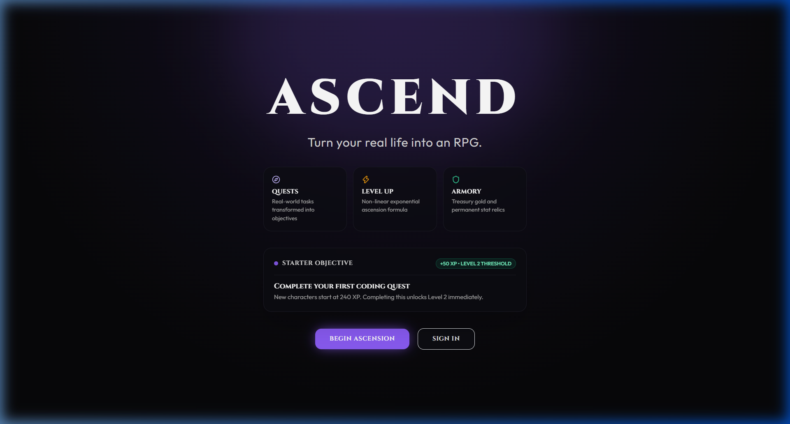<br/>*Landing page with dark fantasy aesthetic and core RPG pillars* | 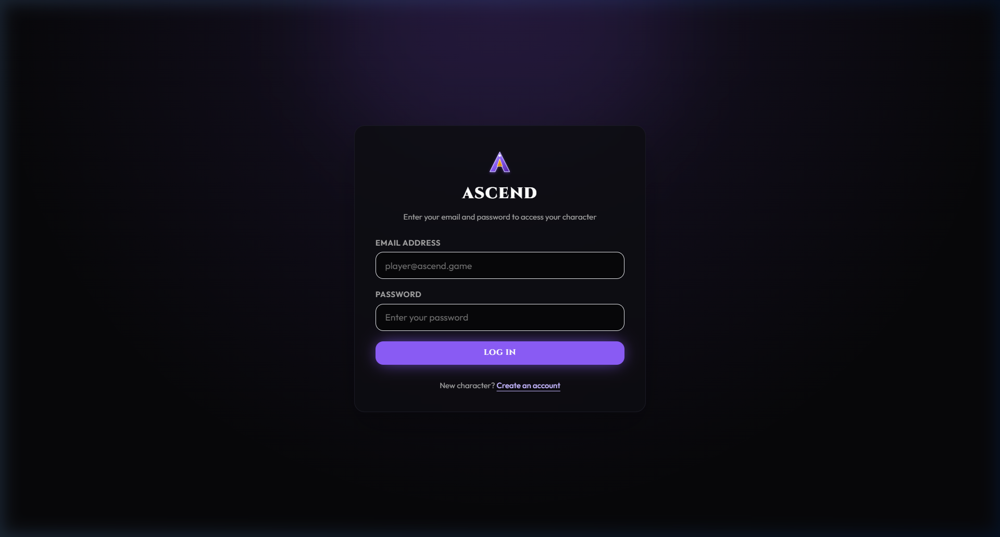<br/>*Authentication gateway with NextAuth session security* |

| Command Nexus Dashboard | Level-Up Ascension Modal |
| :---: | :---: |
| 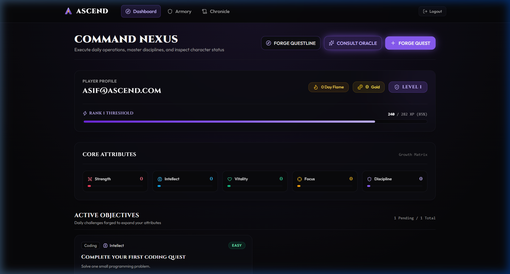<br/>*Command Nexus with character HUD, attributes, and daily objectives* | 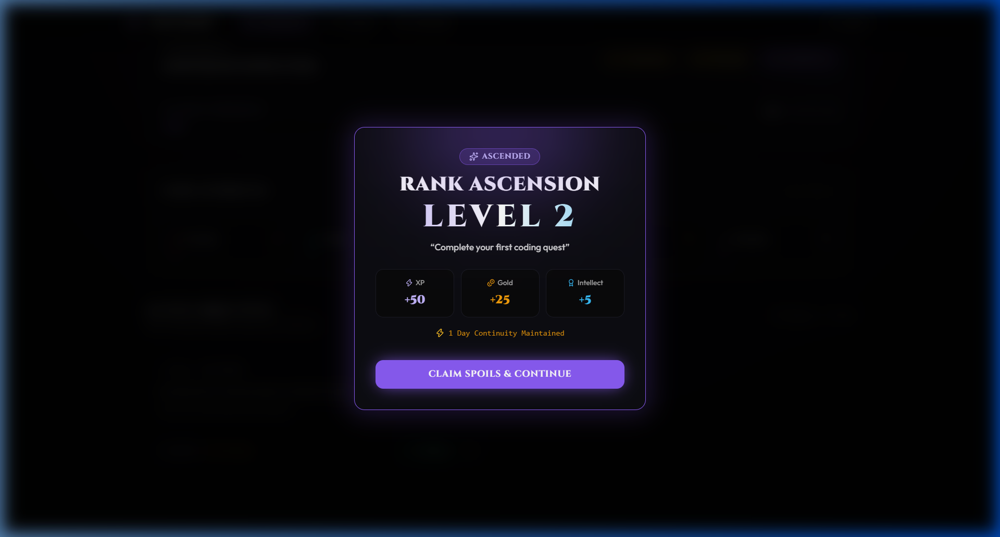<br/>*Signature Level-Up Ascension celebration modal with particle bursts* |

| AI Oracle Quest Generator | Questline Campaign Chain |
| :---: | :---: |
| 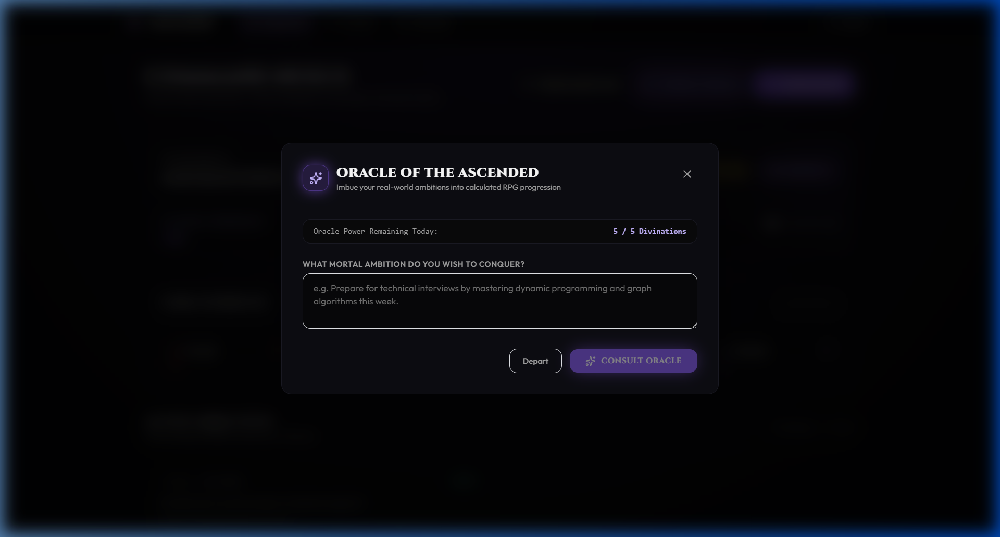<br/>*AI Oracle divining structured quest trials with editable drafts* | 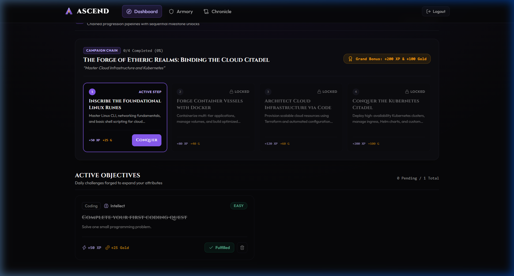<br/>*Decomposed milestone campaign with locked and unlocked progression* |

| Armory Item Vault | Chronicle Ledger & Saga |
| :---: | :---: |
| 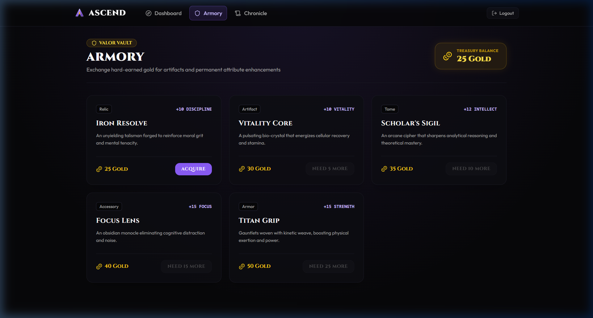<br/>*Armory vault showcasing treasury balance and stat-boosting relics* | 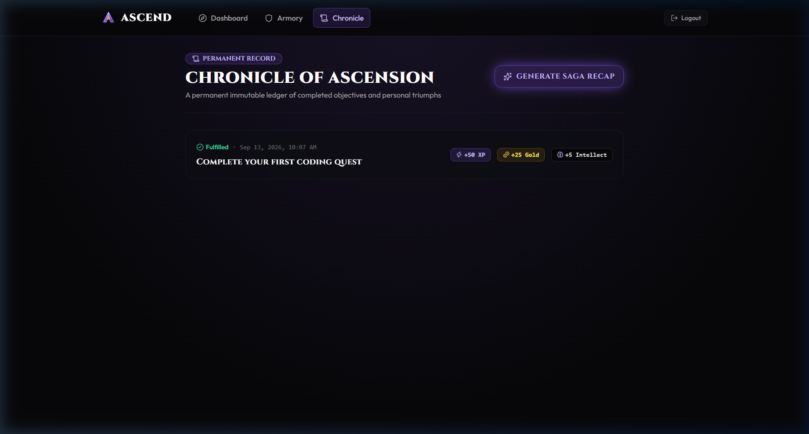<br/>*Immutable heroic history ledger and AI Saga narrative recap* |

<div align="center">
  <br/>
  <strong>Mobile Command Nexus (Responsive 390px Viewport)</strong><br/><br/>
  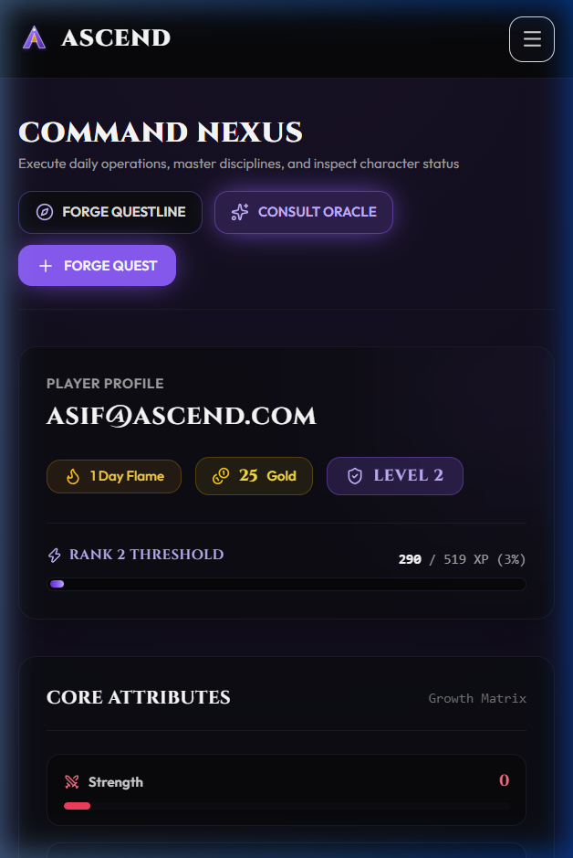
  <p><em>Fully responsive mobile drawer navigation and vertically stacked attribute HUD</em></p>
</div>

---

## Architecture

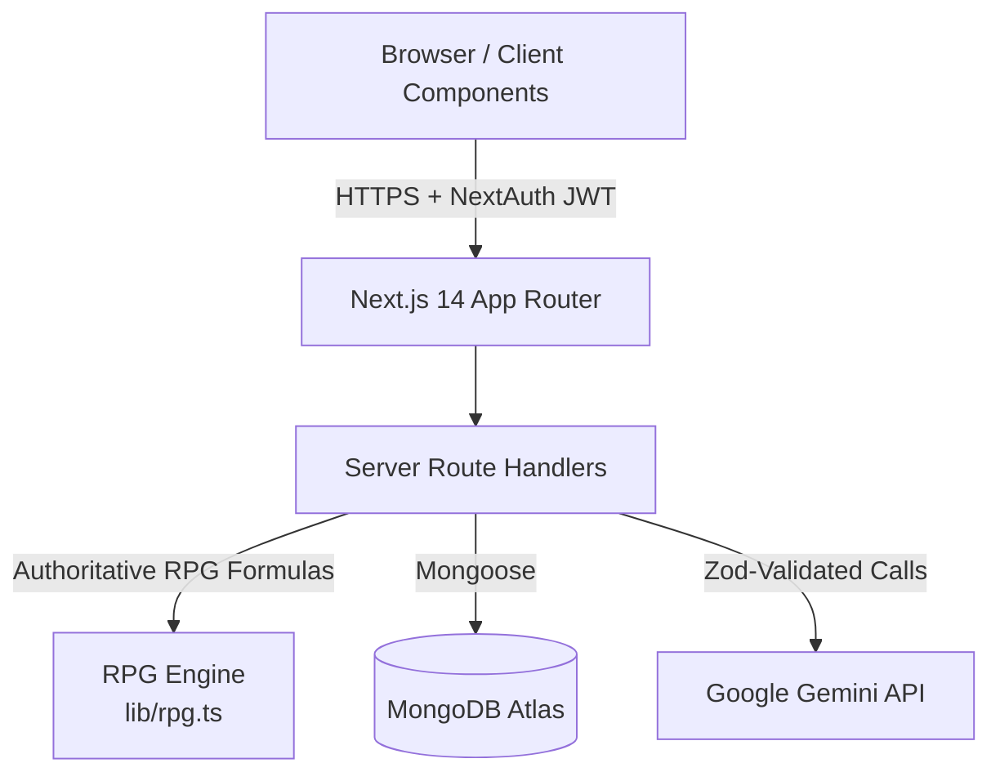

---

## Progression Flow

Rewards are calculated strictly server-side. The client submits only quest IDs; numbers and stats are never accepted from the client.

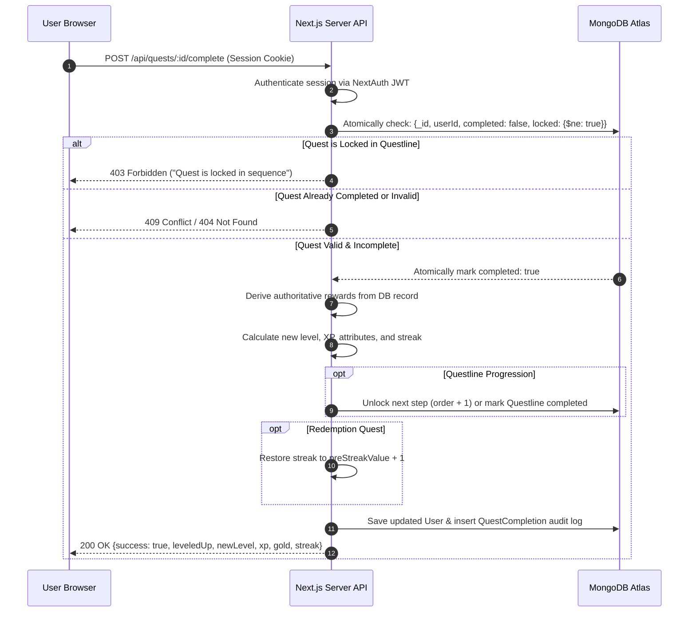

---

## Tech Stack

Derived directly from [`package.json`](package.json):

- **Framework:** Next.js `14.2.24` (App Router)
- **Language:** TypeScript `5.7.3` (Strict Mode)
- **Styling:** Tailwind CSS `3.4.17`, PostCSS `8.4.49`, Autoprefixer `10.4.20`
- **Database & ODM:** MongoDB Atlas with Mongoose `9.10.0`
- **Authentication:** NextAuth.js `4.24.15` (JWT Credentials Provider)
- **Password Hashing:** bcryptjs `3.0.3` (12 salt rounds)
- **AI Integration:** Google Generative AI SDK `@google/generative-ai` `0.24.1` with `gemini-3.6-flash`
- **Schema Validation:** Zod `4.6.4`
- **Iconography:** Lucide React `1.45.0`
- **Runtime:** Node.js 20.x, React `18.3.1`, React DOM `18.3.1`

---

## Project Structure

Top-level architecture:

```text
ascend-life-rpg/
├── app/            # Next.js App Router (pages, layouts, and API route handlers)
├── components/     # Reusable UI components, modals, HUDs, and navigation
├── docs/           # Documentation assets and screenshots
├── lib/            # Server utilities (RPG formulas, auth options, MongoDB, AI client)
├── models/         # Mongoose database models and schema definitions
├── public/         # Static assets (favicons, manifests, and vector graphics)
└── types/          # Global TypeScript interfaces and module augmentations
```

---

## Getting Started

### Prerequisites
- Node.js 18.x or 20.x installed
- A free MongoDB Atlas cluster URI
- A Google Gemini API key

### 1. Clone & Install
```bash
git clone https://github.com/mohdasif-v1/ascend-life-rpg.git
cd ascend-life-rpg
npm install
```

### 2. Configure Environment Variables
Copy the template and provide your credentials:
```bash
cp .env.example .env.local
```

Edit `.env.local`:
```env
MONGODB_URI=mongodb+srv://<username>:<password>@<cluster>.mongodb.net/ascend?retryWrites=true&w=majority
NEXTAUTH_URL=http://localhost:3000
NEXTAUTH_SECRET=your_nextauth_secret_key_here
GEMINI_API_KEY=your_google_gemini_api_key_here
```

### 3. Run Development Server
```bash
npm run dev
```

Open [http://localhost:3000](http://localhost:3000) in your browser.

---

## Environment Variables

| Variable | Description |
| :--- | :--- |
| `MONGODB_URI` | Connection string for MongoDB Atlas database. |
| `NEXTAUTH_URL` | Canonical application URL (`http://localhost:3000` locally or production domain). |
| `NEXTAUTH_SECRET` | Cryptographic key used to encrypt and sign NextAuth JWT session tokens. |
| `GEMINI_API_KEY` | Google AI Studio API key used for Oracle quest generation and Questlines. |

---

## Security Highlights

- **Session-Derived Identity:** Endpoints extract user identity exclusively from decrypted server-side NextAuth tokens (`session.user.id`). User IDs provided in request bodies are ignored.
- **Server-Side Ownership Verification:** Quests and inventory items require verified matching `userId` ownership prior to modification.
- **Zero Client Trust for Numbers:** XP gains, Gold earnings, and level curves are computed exclusively by the server using verified difficulty metrics.
- **Atomic Operations:** Quest completions utilize atomic `findOneAndUpdate` conditions, and store purchases require `{ gold: { $gte: price } }` combined with atomic deduction to eliminate race conditions and double-spending.
- **AI Output Validation & Guardrails:** AI prompts must validate against strict Zod schemas with automatic retries on malformed JSON.
- **Human-in-the-Loop Review:** AI-generated quests and questlines are returned as editable drafts and require explicit user confirmation before persisting to the database.

---

## Judge Walkthrough

To review the application's core progression flow in under 3 minutes:

1. **Sign Up:** Navigate to [Live Demo](https://ascendliferpg.mohdasifv1.dev/signup) and register a new account.
2. **Guaranteed Ascension:** New accounts are initialized at Level 1 with 240 XP. Complete the starter quest ("Complete your first coding quest", +50 XP) to reach 290 XP, crossing the Level 2 threshold (282 XP) and triggering the Ascension celebration modal.
3. **Consult the Oracle:** Click **CONSULT ORACLE** on the dashboard, input a real-world ambition (e.g., "Master TypeScript generics"), and review the generated tactical trials. Edit or accept the drafts.
4. **Forge a Questline:** Click **FORGE QUESTLINE** to decompose a broad campaign (e.g., "Build a full-stack SaaS in 30 days") into an escalating 3–5 step sequence. Confirm Step 1 is unlocked while subsequent steps are locked.
5. **Enforce Progression:** Conquering Step 1 unlocks Step 2 in the chain; completing the final step unlocks the Campaign Conquered bonus modal (+200 XP, +100 Gold).
6. **Armory & Economy:** Visit the **Armory** and spend earned Gold on permanent attribute relics. Notice the atomic treasury balance updates and owned status.
7. **Chronicle Ledger:** Visit the **Chronicle** to review the permanent audit ledger and click **RECALL HEROIC SAGA** to generate an AI narrative recap.

---

## Demo Video

The final demonstration video complies with submission requirements (approx. 120 seconds):

[Watch the Demo Video](https://drive.google.com/file/d/17iRIHV34MxUZvH7ZaoTiV5N5TiI-lS83/view?usp=drive_link)

---

<details>
<summary><strong>Full Database Schema Reference</strong></summary>

### Users Collection (`models/User.ts`)
```typescript
interface IUser {
  email: string;
  passwordHash: string;
  level: number;
  xp: number;
  gold: number;
  currentStreak: number;
  longestStreak: number;
  lastActivityDate: Date | null;
  attributes: {
    strength: number;
    intellect: number;
    vitality: number;
    focus: number;
    discipline: number;
  };
  streakStatus: "active" | "ember";
  emberDeadline: Date | null;
  preStreakValue: number | null;
  lastRedemptionAt: Date | null;
  aiGenerationsToday: number;
  aiGenerationsResetAt: Date | null;
  createdAt: Date;
  updatedAt: Date;
}
```

### Quests Collection (`models/Quest.ts`)
```typescript
interface IQuest {
  userId: ObjectId;
  title: string;
  description: string;
  category: string;
  attribute: "strength" | "intellect" | "vitality" | "focus" | "discipline";
  difficulty: "easy" | "medium" | "hard" | "epic";
  xpReward: number;
  goldReward: number;
  completed: boolean;
  completedAt: Date | null;
  source: "manual" | "ai";
  isRedemption: boolean;
  expiresAt: Date | null;
  questlineId: ObjectId | null;
  order: number | null;
  locked: boolean;
}
```

### Questlines Collection (`models/Questline.ts`)
```typescript
interface IQuestline {
  userId: ObjectId;
  title: string;
  goal: string;
  status: "active" | "completed" | "abandoned";
  createdAt: Date;
  updatedAt: Date;
}
```

### Items Collection (`models/Item.ts`)
```typescript
interface IItem {
  name: string;
  description: string;
  price: number;
  type: "Armor" | "Weapon" | "Tome" | "Relic" | "Potion";
  attributeBonus: {
    attribute: "strength" | "intellect" | "vitality" | "focus" | "discipline";
    value: number;
  };
}
```

### Inventory Collection (`models/InventoryItem.ts`)
```typescript
interface IInventoryItem {
  userId: ObjectId;
  itemId: ObjectId;
  quantity: number;
  acquiredAt: Date;
}
```

### Quest Completions Collection (`models/QuestCompletion.ts`)
```typescript
interface IQuestCompletion {
  questId: ObjectId;
  userId: ObjectId;
  xpEarned: number;
  goldEarned: number;
  attribute: "strength" | "intellect" | "vitality" | "focus" | "discipline";
  attributeXp: number;
  completedAt: Date;
}
```
</details>

<details>
<summary><strong>Complete API Route Reference</strong></summary>

| Endpoint | Method | Auth | Description |
| :--- | :--- | :--- | :--- |
| `/api/auth/register` | `POST` | Public | Registers a new player with hashed password and starter quest. |
| `/api/auth/[...nextauth]` | `GET/POST` | Public | NextAuth session authentication and JWT signing. |
| `/api/health` | `GET` | Public | System status and database connectivity check. |
| `/api/user/character` | `GET` | Authenticated | Retrieves player level, XP, gold, streak, attributes, and ember state. |
| `/api/quests` | `GET/POST` | Authenticated | Lists active quests or creates a new manual quest. |
| `/api/quests/[id]` | `PATCH/DELETE` | Authenticated | Edits or deletes an uncompleted quest owned by the user. |
| `/api/quests/[id]/complete` | `POST` | Authenticated | Authoritatively completes a quest, advances streaks/XP, and unlocks next questline step. |
| `/api/quests/generate` | `POST` | Authenticated | Prompts Gemini to generate 2–3 quest drafts from an objective. |
| `/api/quests/history` | `GET` | Authenticated | Retrieves completed quest audit ledger entries. |
| `/api/quests/saga` | `POST` | Authenticated | Generates narrative AI summary of completed trials. |
| `/api/questlines` | `GET/POST` | Authenticated | Lists active questline chains or instantiates confirmed questline. |
| `/api/questlines/generate` | `POST` | Authenticated | Decomposes ambition into sequential 3–5 step questline drafts. |
| `/api/streak/check` | `GET` | Authenticated | Evaluates calendar-day boundaries and generates Sacred Ember redemption trials. |
| `/api/items` | `GET` | Authenticated | Lists Armory catalog items and user inventory ownership. |
| `/api/items/[id]/purchase` | `POST` | Authenticated | Atomically deducts gold and adds item to player inventory. |

</details>

---